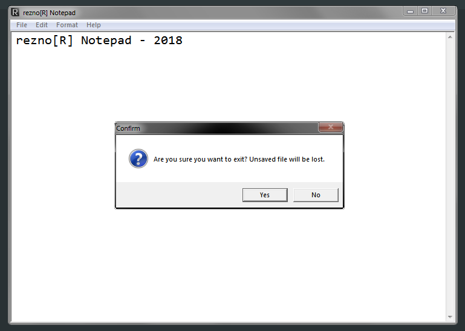

# Learning Object C++ - Windows Builder Reznor Notepad
> Training course - Pasja Informatyki, Object C++ course, episode 8 ( [Link](https://www.youtube.com/watch?v=0gs1LDbXF0k) )

## General info
Windows GUI program written in C++ Builder 6.0. It's a Notepad that has all the usual functions, like New, Open, Save, Save As, Exit, Cut, Copy, Paste, Select All, Word Wrap, Change Font, Help, Information about the author and a link to my youtube channel. It has also a custom icon, can save .txt and .ini files. It prompts about confirmation if the text field is not empty or user wants to create a new file.

## Technologies
* C++
* C++ Builder 6.0 (IDE)

## Screenshots

## Contact
[ReznoRMichael](https://github.com/ReznoRMichael)